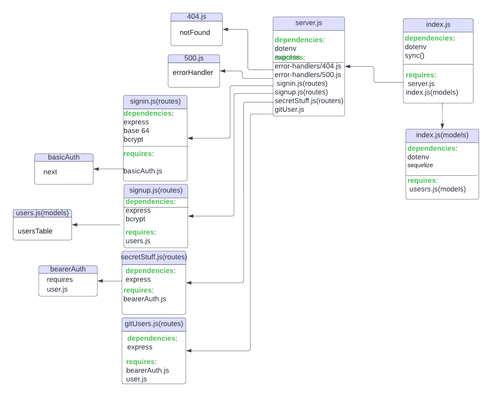
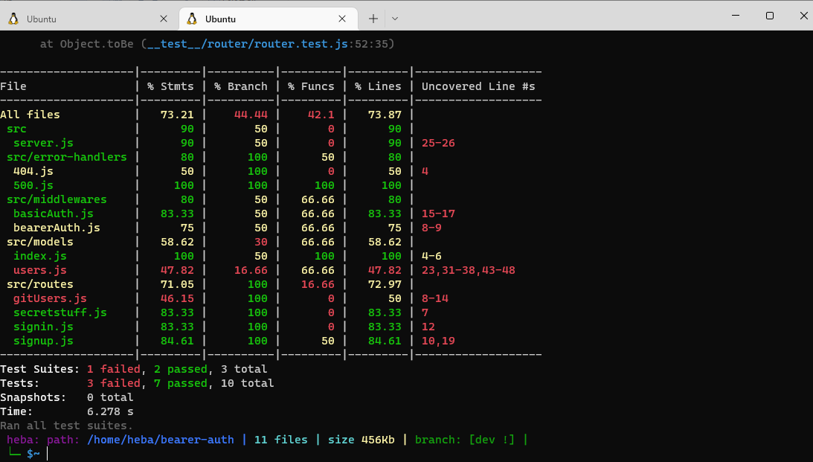

# bearer-auth
## Links
## [Link for repo](https://github.com/HebaAlhamaydh/bearer-auth)
## [Link for PullRequest](https://github.com/HebaAlhamaydh/bearer-auth/pull/1)
## [Link for Heroku](https://heba-bearer-auth.herokuapp.com/)

## UML

## Test

